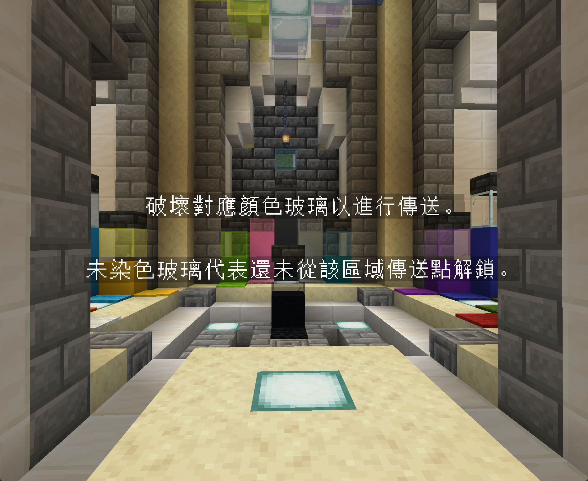

最近在和朋友玩了很多的《Minecraft》的 Complete the Monument 的地图。这些地图通常是玩家自己制作，然后发布在网上的，制作者遍布世界各地，当然质量也是有好有坏。在找地图玩的过程中，我发些有一些中文的地图我觉得制作很有特色，可惜没有英文版本，而和我玩的朋友又不会读华文，所以我开始寻找把中文地图翻译成英文的办法。

---

说起《Minecraft》地图翻译，大致可以分成两类地图来讨论。第一类地图，是作者在制作地图的时候就考虑到了多语言的情况。地图里面用到的所有文本，用的都是 translation key，像是 `text.example.desc` 而不是直接写文字。在载入材质包之后，地图会自动根据游戏语言，依照材质包里 `assets/.../lang/zh_tw.json` 的映射，把这些 key 渲染成可阅读的文字。这里的 `zh_tw.json` 意味着繁体中文的翻译文件，其它语言还有例如 `en_us.json`，`zh_cn.json`，`zh_hk.json` ...

例如在《Cartocraft II》中，传送门区域显示的文字就是通过这种方式实现的。

材质包里的 `assets/teleporter/lang/zh_tw.json` 文件大致如下：

```json
{
  "text.teleporter.description_1": "破壞對應顏色玻璃以進行傳送。",
  "text.teleporter.description_2": "未染色玻璃代表還未從該區域傳送點解鎖。"
}
```




如果你在网上下载一张地图，其材质包里 `assets/.../lang` 目录下有像这样的语言文件，那就属于这一类地图，你只需要把源语言的json文件丢给LLM就可以翻译了。

---

但是现实里，大部分你从网上下载的地图，都没有设置这样的translation key，也就是第二类地图。就算一些制作十分精良的地图也没有，例如[《The Sky Blessing》](https://tsb.scriptarts.jp/)。这一类地图，地图中的告示牌、文字实体、指令方块、数据包里的string，都是直接写的自然语言，也就是硬编码。这些自然语言散落在地图的各个角落，甚至一些指令方块只有作者知道放在哪。对于这样的地图，如果人工一条条去改指令，改告示牌，那需要付出的努力是难以估量的。

我最近在尝试把一些只有中文或日文版本的 CTM 地图翻译成英文，方便和 English speaker 一起游玩。在查找方案的过程中，我在 GitHub 上发现了一个[项目](https://github.com/iAkariAk/TSB-CN)，它实现了对《The Sky’s Blessing》这张日文地图从日文到中文的**自动化翻译**。

---

对于没有使用 `translation key` 的地图，翻译的真正难点并不在于语言转换，而在于**如何定位文本**。

在《The Sky’s Blessing》中，所有给玩家显示的文字，主要分布在两类位置：

* **数据包（datapack）**
  * `.json` 文件中的文本组件
  * `.mcfunction` 中 `tellraw`、`title` 等指令参数

* **世界存档（NBT）**
  * 告示牌、书本、命令方块
  * 物品名称与 Lore
  * 实体的自定义名称

项目在处理数据包时，并没有尝试完整解析 Minecraft 的语义，而是采取了一种非常务实的做法：
**只要是可能包含文本的文件，先全部读出来。**

简化后的逻辑大致如下：

```python
from zipfile import ZipFile, Path as ZipPath

def extract_datapack_strings(zip_path):
    with ZipFile(zip_path) as zf:
        root = ZipPath(zf)
        for path in root.iterdir():
            if path.name.endswith((".json", ".mcfunction")):
                text = path.read_text(encoding="utf-8", errors="ignore")
                yield text
```

这些文件被当作普通文本读取，具体哪些字符串需要翻译，留到后面再判断。

---

对于世界存档中的文字，项目则通过遍历区块里的 **NBT 数据** 来处理。告示牌、书本、命令方块等方块实体，最终都会以字符串的形式保存在 NBT 结构中。

核心思路同样非常直接：
**递归遍历 NBT，只要遇到字符串，就收集起来。**

```python
def extract_strings_from_nbt(tag):
    if isinstance(tag, str):
        return [tag]
    if isinstance(tag, list):
        return sum((extract_strings_from_nbt(t) for t in tag), [])
    if isinstance(tag, dict):
        return sum((extract_strings_from_nbt(v) for v in tag.values()), [])
    return []
```

通过这种方式，不需要关心具体方块类型，就可以把世界中所有潜在的文本字符串统一提取出来。

---

真正让自动化翻译成为可能的，是项目中一个看似简单、但非常关键的筛选条件：

> **在日文（或中文）地图中，几乎所有需要翻译的文本都包含非 ASCII 字符。**

基于这一观察，项目在收集到所有字符串之后，只保留包含非 ASCII 字符的部分：

```python
def contains_non_ascii(s: str) -> bool:
    return any(ord(c) > 0x7F for c in s)

candidates = [
    s for s in all_strings
    if contains_non_ascii(s)
]
```

这一步在实际地图中效果非常好。
它可以高概率地筛选出：

* 剧情文本
* UI 提示
* 任务描述
* 告示牌与书本内容

同时自然避开：

* 命令关键字
* 命名空间与资源 ID
* 路径、配置字段名

---

在将这些文本交给 LLM 翻译之前，项目还做了一步很重要的处理：
**保护不能被修改的格式和占位符**，例如 `§a`、`%1$s`、`\n` 等。

这些内容会先被替换成占位符，翻译完成后再原样还原，避免破坏游戏可识别的格式。

正是基于这一整套流程，《The Sky’s Blessing》的日文文本才能被批量提取并自动翻译。  