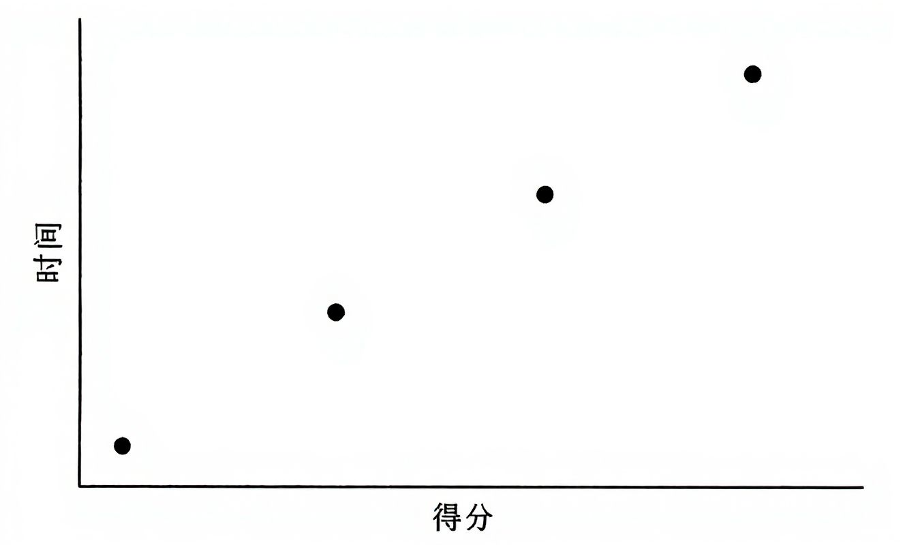
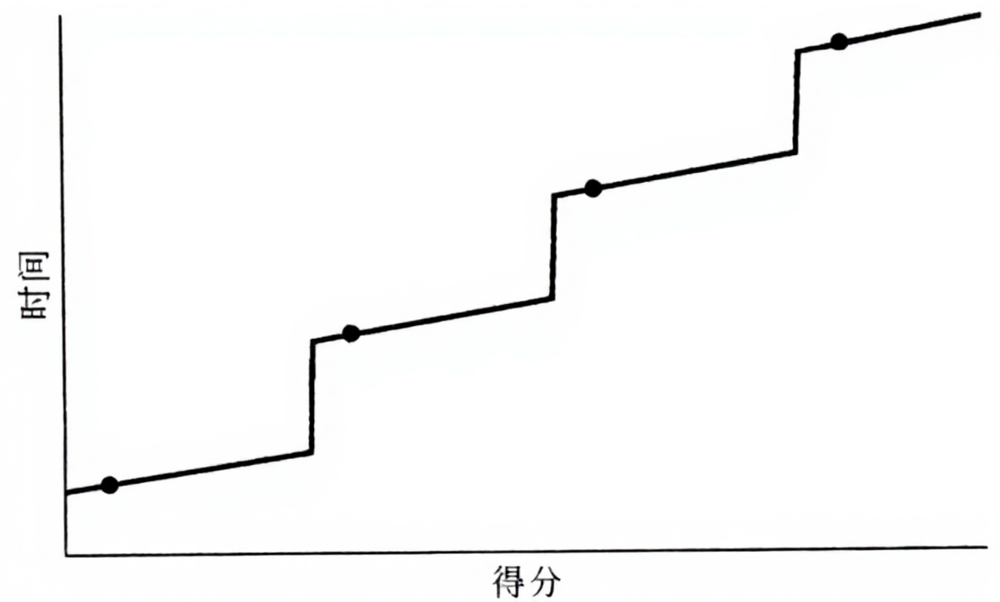
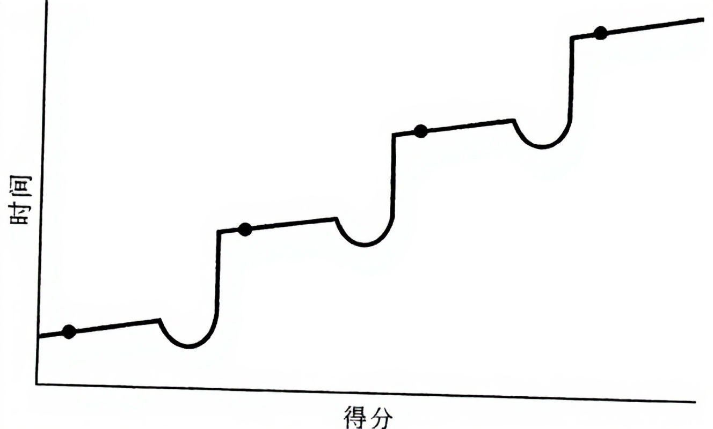
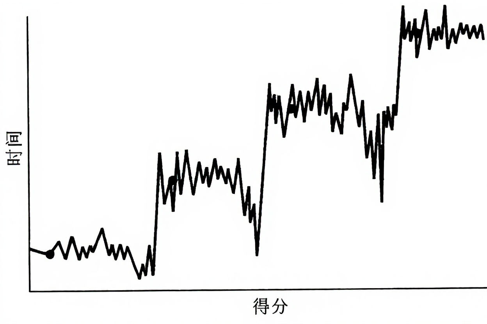
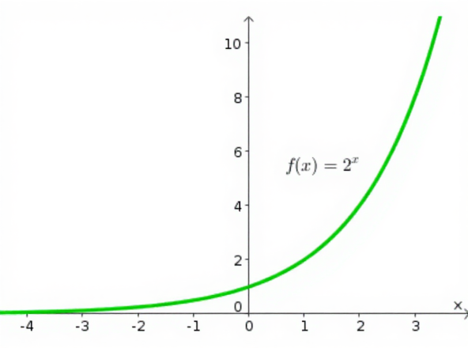
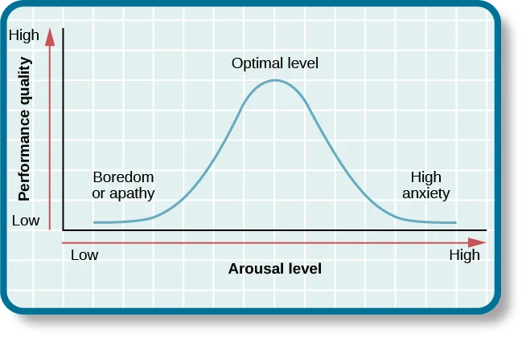

罗曼·罗兰曾说过：“大部分人在二三十岁上就死去了，因为过了这个年龄，他们只是影子。此后的余生都是在模仿前半生中度过，日复一日，更机械，更装腔作势地重复他们在有生之年的所作所为，所思所想，所爱所恨。”

AI 是低谷期的麻醉剂

低谷-高原模型

舒适区的两重含义：
消遣毒害大脑——you are what you eat. Garbage in garbage out. 人不擅长记住信息源，这也是为什么广告和大众媒体有效。

> 每天你都会收到成千上万的广告，你无法逃脱、应接不暇，几乎喘不过气来。广告打断了你在网上的阅读；会出现在网站的空白处；每次购买都会面对广告；在大多数电视节目之前都会插播广告；在每个加油站、自动取款机和公共汽车长凳上都张贴着广告。
> ...
> 尽管我们很少意识到自己接受了广告的影响——我们不会在看过广告之后立刻从椅子上跳起来，冲到超市去买艾德熊乐啤露——但它可以启动一个长期的过程，在我们今后进行选择的时候，间接地促使我们购买大量的广告产品。

Sleeper effect

> 不能影响你编程观点的语言，不值得你去学。
> [Alan Perlis](https://en.wikipedia.org/wiki/Alan_Perlis)

理论上，随着人们知识的积累，学习能力和思维能力理论上会不断增加，学习曲线的斜率也理论上会不断增加，最后的学习曲线会类似一个二次函数或者指数函数

标题：
大纲：

什么是需要走出舒适圈：//我这样归类对不对

1. 慢性腐蚀（娱乐消遣） 2. 广告什么有效（Sleeper Effect 且 长期浸泡） 3. 低质量消遣更是如此（无主观抵抗，DIKW 模型，远离低质量内容） 4. 消遣可以不低质量
2. 停留圈（思维惯性阻止进步）//这个有没有专业的名字 6. 学习曲线 7. 低谷-高原模型
3. 危险圈（停留圈的延申，时代变化，旧技能跟不上时代，可能导致结构性失业，需要脱离旧技能学习新技能） 9. 现实社会的低谷-高原模型 10. 不是每一个低谷都会通向高原（选择很重要，外界条件例如大环境和自己的经济基础决定选择容错和试错成本）

AI 时代的舒适圈 1. AI 时代下的互联网（AI 降低创作门槛，生产大量低质、同质内容） 2. AI 对学习曲线的影响，警惕“AI 作弊”的陷阱，让 AI 成为提升初期学习曲线斜率的好帮手

最近看了 Wiwi.Blog 有关“跳脱舒适圈”[^1]的 Blog 文章之后，也想来谈谈关于舒适圈的话题。虽说走出舒适圈可能已经被大家讲过无数遍，但为什么要走出舒适圈，什么是真正需要走出的舒适圈，有哪些容易被忽视的舒适圈陷阱，以及 AI 时代又会带来哪些变化，还是值得好好唠唠。毕竟关于学习与人生是一生都值得探寻的话题。

# 到底什么是走出舒适圈？

首先为什么要走出舒适圈？难度是因为它舒适所以才走出吗？当然不是，那样的话只会变成自虐狂，或者实在假装很努力而已。

首先要澄清几个事实：

1. 走出舒适圈本身不是目的，而是手段。核心目的是让自己高效地进步。

2. 舒适圈不是一个固定的范围，而是会随着我们的经验、能力和环境变化而不断移动。

   - 学会新技能 → 舒适圈变大
   - 行业淘汰 → 舒适圈可能缩小

3. 舒适圈不是贬义词。舒适圈本质上是一个低焦虑、低风险、高可控的状态。

## Yerkes-Dodson 定律

心理学家 Yerkes 和 Dodson 在 1908 年提出了一个著名定律：[耶克斯-多德森定律（Yerkes-Dodson Law）](https://www.simplypsychology.org/what-is-the-yerkes-dodson-law.html) 描述了兴奋度（arousal level）与表现质量（performance quality）之间的关系。

- 横轴兴奋度（Arousal level）可以理解为紧张程度，比如考试复习周的 arousal level 通常会很高，放假闲在家的 arousal level 通常会低。
- 纵轴表现质量（Performance quality）可以理解成做事的效率，或者做事的质量、创造力等等。

这张图展现了 Yerkes-Dodson 定律描述的关系：

- 如果兴奋度（紧张程度）**太低** → 你可能提不起劲、打瞌睡，表现会差（左边“Boredom or apathy”区域）。
- 如果兴奋度**刚刚好** → 你会全神贯注，表现达到最好（中间“Optimal level”区域）。
- 如果兴奋度**太高** → 紧张、慌乱、手抖、脑子一片空白，表现下降（右边“High anxiety”区域）。

如果把“舒适圈”放到这张图里，大概是在**偏左、兴奋度较低**的区域，是让你觉得轻松、没有太大压力的地方。**走出舒适圈** = 往最佳点靠近甚至略微超过它（兴奋度上升一点）。

# 日常生活中有哪些舒适圈陷阱

## 第一类：持续摄入`低质量`内容

==你以为是在放松，其实是在慢性自废武功==

想象一下：你躺在床上刷手机，一刷就是 3 个小时。或许是看着短视频，或许是沉迷于哪些纯粹为了刺激多巴胺而设计的游戏，刷评论区看网友互骂（还暗暗觉得自己赢了）。一整晚，出了手指酸痛和眼睛干涩之外，得到的只有被慢性腐蚀的大脑。

这些低质量内容有个共同特点：容易接受，但毫无营养。

很多人说 LLM（大语言模型）是"garbage in, garbage out"（垃圾进，垃圾出）。相较于什么都学的 LLM，记忆力更差，“硬盘”容量有限的人类大脑就更是"you are what you eat"（你吃什么就是什么）——你输入什么垃圾，就会输出什么垃圾。

有些人可能会说：”我能分辨哪些是低质量，哪些是高质量。人又不是海绵，我虽然看低质量和高质量，但是我只输出高质量不就行啦？“不，你可能很难做到。我来跟你讲为什么。

### 广告的魔法

埃利奥特·阿伦森所著的《社会性动物》里面有提到广告对人们潜移默化的影响：

> 每天你都会收到成千上万的广告，你无法逃脱、应接不暇，几乎喘不过气来。广告打断了你在网上的阅读；会出现在网站的空白处；每次购买都会面对广告；在大多数电视节目之前都会插播广告；在每个加油站、自动取款机和公共汽车长凳上都张贴着广告。
> ...
> 尽管我们很少意识到自己接受了广告的影响——我们不会在看过广告之后立刻从椅子上跳起来，冲到超市去买艾德熊乐啤露——但它可以启动一个长期的过程，在我们今后进行选择的时候，间接地促使我们购买大量的广告产品。

虽然大家都知道广告有夸张、美化甚至造假的嫌疑，但为什么还是会买呢？因为广告的魔法有两个核心机制：

1. **曝光效应**（Mere Exposure Effect）——人类更容易购买自己熟悉的东西
2. **沉睡者效应**（Sleeper Effect）——随着时间推移，人会忘记信息来源，但保留信息本身。这使得来源可信度较低的消息随时间变得更可信。
   - **政治宣传**：针对对手阵营投放信息，过一段时间后可能削弱原有防备。
   - **谣言**：一开始知道是假的，但过久了只记得内容，忘记它是假消息。

### 那低质量娱乐更恐怖在哪？

这些会让你有所防备的广告、谣言和政治宣传是如此，那些看上去人畜无害的低质量内容更是如此。不仅如此，低质量娱乐还会降低你大脑的可塑性，让你更难学新东西。耶鲁大学的研究发现，当人处于长期稳定、没有挑战的状态时，大脑负责学习和适应的区域会逐渐“关机”——因为它认为你不需要变化[^2]。长此以往，你的舒适圈会越来越下移，就越来越难欣赏高质量内容了。所以要有意识地主动控制输入质量，才有可能有高质量输出，而不被低质量内容吞噬和同化。

### 那是不是说我们不能娱乐了？

当然不是，消遣 ≠ 低质量。如果你觉得你的消遣能给你灵感、激发你创造力，或是能让你感受到价值，我觉得都不算慢性腐蚀圈。比如：

- 一个有趣的 JRPG 游戏
- 一部能让你思考的电影
- 一本能改变你观点的书
- 一次旅行
- 任何自己的兴趣爱好
- ......

关键是要**主动选择**，比如使用 RSS 主动筛选信息源。

## 第二类：过久地停留在`高原时期`

==看似在进步，实则原地踏步==

你觉得人类的学习曲线应该是什么样的呢？

    A. 是线性的
    B. 越来越慢
    C. 越来越快

理论上，随着人们知识的积累，学习能力和思维能力理论上会不断增加，学习曲线的斜率也理论上会不断增加，越学越快，最后的学习曲线会类似一个二次函数或者指数函数[^3]。

现实常常不是——更贴近 **“低谷–高原”模型** ：**长时间的平缓积累（高原）+ 少数关键突破（飞跃），且每次飞跃前通常要经历一个“低谷”**。

这套模型出自 Gerald M. Weinberg 的《成为技术领导者》。他用**玩弹子球**练习做了记录：

[ChatGPT](https://chatgpt.com/g/g-yP7nvstO8-story/c/689a475c-ff6c-8329-b7db-03b6776854ec)
[ChatGPT](https://chatgpt.com/g/g-PWizFQk8C-blog-expert-seo-blogs-made-easy/c/689a9061-7cf0-8321-a41e-d1004bfb989a)
[Claude](https://claude.ai/chat/27babd22-bc84-477a-9651-2a037d60c299)
[跳脫舒適圈 | Wiwi.Blog](https://wiwi.blog/blog/comfort-zone/)
[AI 提升的是下限，而不是上限 | 宝玉的分享](https://baoyu.io/translations/ai-is-a-floor-raiser-not-a-ceiling-raiser)
[学习与人生——700篇博文之感悟 @ 编程随想的博客](https://program-think.blogspot.com/2020/12/Study-and-Life.html)
[时间与人生——跨入本世纪20年代的随想 @ 编程随想的博客](https://program-think.blogspot.com/2019/12/Time-and-Life.html?q=20%E5%B9%B4%E4%BB%A3&scope=all)
[如何【系统性学习】——从“媒介形态”聊到“DIKW 模型” @ 编程随想的博客](https://program-think.blogspot.com/2019/10/Systematic-Learning.html)